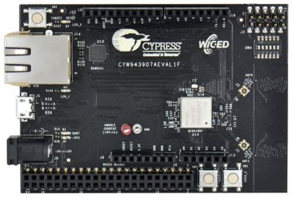

# CYW943907AEVAL1F BSP

## Overview

The CYW943907AEVAL1F Evaluation kit enables you to evaluate and develop single-chip Wi-Fi applications using CYW43907 devices. The kit uses a module based on CYW43907 device. CYW43907 is a single-chip 802.11n dual-band (2.4 GHz and 5 GHz) Wi-Fi SoC that features 320-MHz Arm Cortex-R4 MCU for application subsystem and various on-chip interfaces like Ethernet (RMII/MII), UART, SPI/QSPI and I2C that in totality offers a very small-footprint IoT solution.

To use code from the BSP, simply include a reference to `cybsp.h`.

## Features

### Kit Features:

* CYW43907 based module
* On-board PCB antenna with an option to connect external antenna
* Arduino compatible headers for hardware expansion
* Custom header to bring out additional GPIOs (WICED header)
* User switches and LEDs
* On-board programmer and debugger using USB interface and USB-UART bridge
* RJ45 connector for Ethernet
* 5 V to 12 V input using USB connector or power jack

### Kit Contents:

* CYW943907AEVAL1F Evaluation board
* USB Standard-A to Micro-B cable
* Quick Start Guide

## BSP Configuration

The BSP has a few hooks that allow its behavior to be configured. Some of these items are enabled by default while others must be explicitly enabled. Items enabled by default are specified in the CYW943907AEVAL1F.mk file. The items that are enabled can be changed by creating a custom BSP or by editing the application makefile.

Components:
* Device specific category reference (e.g.: CAT1) - This component, enabled by default, pulls in any device specific code for this board.
* BSP_DESIGN_MODUS - This component, enabled by default, causes the Configurator generated code for this specific BSP to be included. This should not be used at the same time as the CUSTOM_DESIGN_MODUS component.
* CUSTOM_DESIGN_MODUS - This component, disabled by default, causes the Configurator generated code from the application to be included. This assumes that the application provides configurator generated code. This should not be used at the same time as the BSP_DESIGN_MODUS component.

Defines:
* CYBSP_WIFI_CAPABLE - This define, disabled by default, causes the BSP to initialize the interface to an onboard wireless chip if it has one.
* CY_USING_HAL - This define, enabled by default, specifies that the HAL is intended to be used by the application. This will cause the BSP to include the applicable header file and to initialize the system level drivers.

See the [BSP Setttings][settings] for additional board specific configuration settings.

## API Reference Manual

The CYW943907AEVAL1F Board Support Package provides a set of APIs to configure, initialize and use the board resources.

See the [BSP API Reference Manual][api] for the complete list of the provided interfaces.

## More information
* [CYW943907AEVAL1F BSP API Reference Manual][api]
* [CYW943907AEVAL1F Documentation](https://www.cypress.com/documentation/development-kitsboards/cyw943907aeval1f-evaluation-kit)
* [Cypress Semiconductor, an Infineon Technologies Company](http://www.cypress.com)
* [Infineon GitHub](https://github.com/infineon)
* [ModusToolbox™](https://www.cypress.com/products/modustoolbox-software-environment)

[api]: https://infineon.github.io/TARGET_CYW943907AEVAL1F/html/modules.html
[settings]: https://infineon.github.io/TARGET_CYW943907AEVAL1F/html/md_bsp_settings.html

---
© Cypress Semiconductor Corporation (an Infineon company) or an affiliate of Cypress Semiconductor Corporation, 2019-2021.